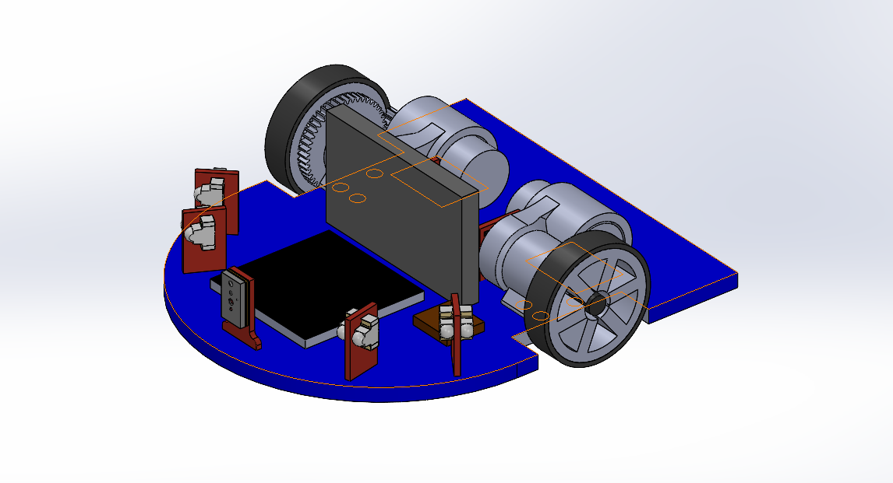
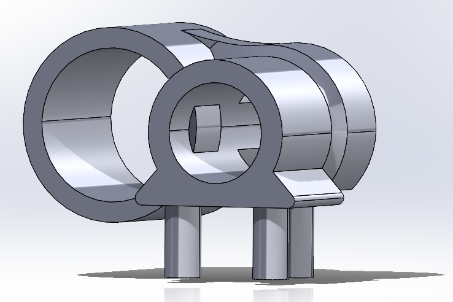

# Mushak (Micromouse CAD model)
* Mushak is a half-size micromouse that solves 16x16 grid of maze with high performance.

  

# Part Descriptions
* The bot contains a total of _ components which are as listed in the following table :

|     Parts    |          Description          |
| ------------ | ----------------------------- |
| 

   | Motors - This is the motor we are using, which has   dimensions: Length x Dia. 12 x 6 mm and a shaft lenght of 6mm.|
   | Motor_mount - This is the mount for the motors, which holds   the motor, shaft, gears, bearing and magnet.Because of less center-to-center distance between gears, after many iterations this mount was designed.|
   | TOF_mount - This is the mount for TOF sensor, which is placed   in front. We have used VL6180x TOF sensor.|  
    | IR_mounts - These are the mounts for IR sensors placed   at specific angles. SFH-3015-FA and SFH-4045N sensors are phototransistors and IR emitters respectively.|   
    | Gears - These are the metal gears from sg90 motors having dimensions:   Driving gear: Teeth 9, Pr.∠20º, ID x OD 0.5 x 2.14 mm, width 2.46 mm.  Driven gear: Teeth 47, Pr.∠20º, ID x OD 1.5 x 9.55 mm, width 1.2 mm.  Center to center distance is 5.80mm and modulus 0.195 | 
    | Bearings, shaft and Wheels - These are the passive components used.  Bearings x4 of dimensions: ID x OD 1.5 x 4 mm.  Shaft x2 of dimensions: Length x Dia. 15 x 1.5 mm.  Wheels with dimensions: ID x OD 1.5 x 12.5 mm.  To avoid play and tilt of shaft, we employed two bearings at one end.|
   || IC's and Battery - The IC's used in CAD model are with their actual dimensions.  Lipo battery of dimension: 1.5 x 2.5 mm.|

 

   
  # Additional Materials
  * Refer the following playlists to sharpen you skills in SolidWorks
  * [Tutorial](https://www.youtube.com/watch?v=Ulttc_2p4DY&list=PLrOFa8sDv6jcp8E3ayUFZ4iNI8uuPjXHe)
