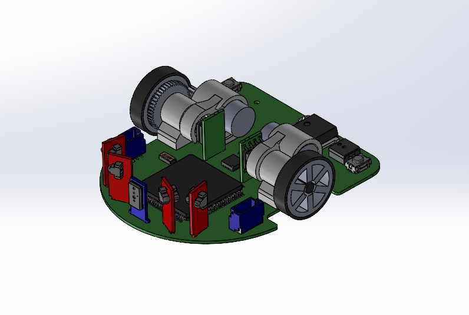
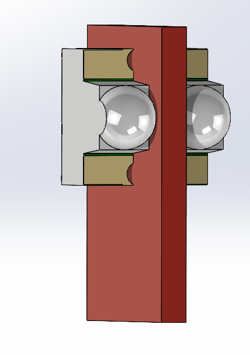

# Mushak (Micromouse CAD model)
* Mushak is a half-size micromouse that solves 16x16 grid of maze with high performance.

  

# Part Descriptions
* The bot contains a total of _ components which are as listed in the following table :

|     Parts             |          Description          |
| --------------------- | ----------------------------- |
| 

   | Motors - This is the motor we are using, which has   dimensions: Length x Dia. 12 x 6 mm and a shaft lenght of 6mm.|
   | Motor_mount - This is the mount for the motors, which holds   the motor, shaft, gears, bearing and magnet.Because of less center-to-center distance between gears, after many iterations this mount was designed.|
   | TOF_mount - This is the mount for TOF sensor, which is placed   in front. We have used VL6180x TOF sensor.|  
    | IR_mounts - These are the mounts for IR sensors placed   at specific angles. SFH-3015-FA and SFH-4045N sensors are phototransistors and IR emitters respectively.|   
    | Gears - The metal gears were extracted from mg90s servos having dimensions:   Driving gear:  &emsp; &emsp; &emsp;&emsp; &emsp;Teeth 9   &emsp; &emsp; &emsp;&emsp; &emsp;Pressure Angle - 20º  &emsp; &emsp; &emsp;&emsp; &emsp;ID - 0.5, OD - 2.14 mm  &emsp; &emsp; &emsp;&emsp; &emsp;Width 2.46 mm  Driven gear:   &emsp; &emsp; &emsp;&emsp; &emsp;Teeth 47   &emsp; &emsp; &emsp;&emsp; &emsp;Pressure Angle 20º  &emsp; &emsp; &emsp;&emsp; &emsp;ID - 1.5mm, OD - 9.55 mm  &emsp; &emsp; &emsp;&emsp; &emsp; Width 1.2 mm.  Center to center distance is 5.80mm and modulus 0.195 | 
    | Bearings, shaft and Wheels - These are the passive components used.  Bearings x4 of dimensions: ID x OD 1.5 x 4 mm.  Shaft x2 of dimensions: Length x Dia. 15 x 1.5 mm.  Wheels with dimensions: ID x OD 1.5 x 12.5 mm.  A combination of 2 bearings is used to house the shaft for better stability and lesser Vibrations.|
   || IC's and Battery - The IC's used in CAD model are with their actual dimensions.  Lipo battery of dimension: 1.5 x 2.5 mm.|

 

  # Issues Faced in Mechanical Designing 
  |   Parts    |       Issues       |
  |------------|--------------------|
  |
| Issue : The main issues faced in designing the Mount were  As the Gears acquired were of a smaller diameter, there was an issue of interference between the bearing and the motor. As they were too close, it was impossible to 3D print a mount with the thickness less than 1mm.   Solution : The solution opted for this was to actually disalign the motor and the shaft to give room the bearing housing to be #d printed. This enabled us to print a more stable base due to the stronger Shaft housing.|
  |
|Issue -  As there are a varieties of gears available. It was hard for us to choose the right combination and Built the Model and mounts around it.   Solution- We started with finalising the sizes and the gear ratios needed according to the available spaces. We then did the market research to find the gears closest to our needs and incorporated those models into the Design.|
  # Additional Materials
  * Refer the following playlists to sharpen you skills in SolidWorks
  * [Tutorial](https://www.youtube.com/watch?v=Ulttc_2p4DY&list=PLrOFa8sDv6jcp8E3ayUFZ4iNI8uuPjXHe)
