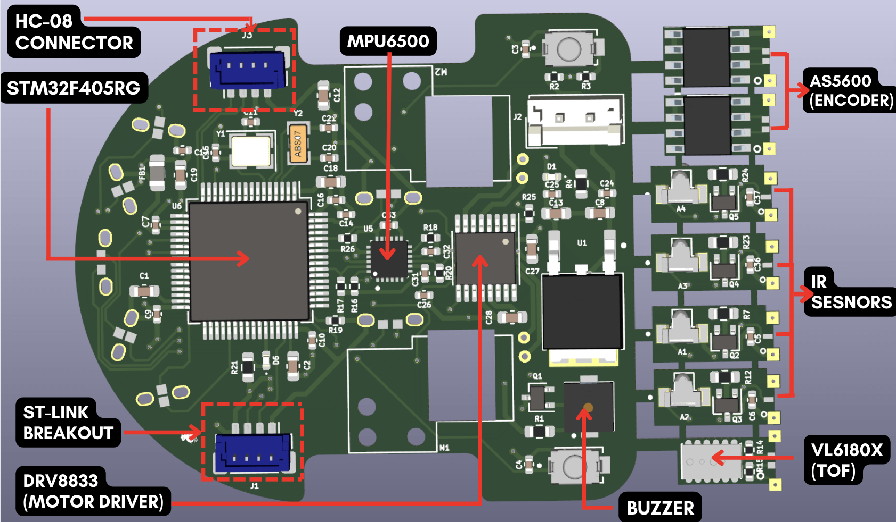
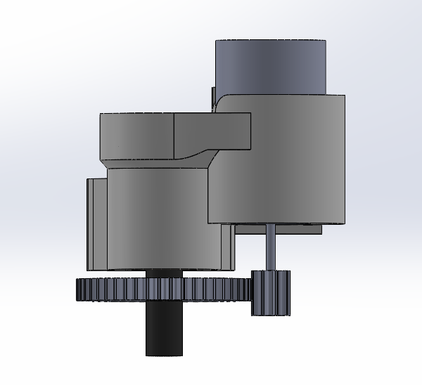

<p align="center">
  
</p>

# Table of Content
- [Table of Content](#table-of-content)
- [About The Project](#about-the-project)
- [File Structure](#file-structure)
- [PCB Design](#pcb-design)
    - [Major components used in the PCB include -](#major-components-used-in-the-pcb-include--)
  - [IR sensors](#ir-sensors)
  - [Power Distribution](#power-distribution)
  - [STM32F405RG (Microcontroller)](#stm32f405rg-microcontroller)
  - [DRV8833 (Motor Driver)](#drv8833-motor-driver)
  - [VL6180X (ToF Sensor)](#vl6180x-tof-sensor)
  - [HC-08 (BLE Module)](#hc-08-ble-module)
  - [AS5600 (Magnetic Encoder)](#as5600-magnetic-encoder)
  - [MPU6500 (IMU)](#mpu6500-imu)
  - [Routing](#routing)
  - [Solutions to some of the major problems faced while designing PCB](#solutions-to-some-of-the-major-problems-faced-while-designing-pcb)
- [CAD Design](#cad-design)
  - [Part Descriptions](#part-descriptions)
  - [Issues Faced in Mechanical Designing](#issues-faced-in-mechanical-designing)
    - [Designing Mount](#designing-mount)
    - [Finalising and Meshing the gears](#finalising-and-meshing-the-gears)
  - [Additional Materials](#additional-materials)
- [Firmware](#firmware)
  - [File Structure](#file-structure-1)
  - [Pinout of STM32F405RG](#pinout-of-stm32f405rg)
    - [Communication Buses](#communication-buses)
    - [ADC](#adc)
    - [PWM](#pwm)
    - [GPIO](#gpio)
  - [How To Use The Firmware](#how-to-use-the-firmware)
    - [Install gcc-arm-none-eabi compiler tool suite](#install-gcc-arm-none-eabi-compiler-tool-suite)
    - [Install ST-Link Toolchain](#install-st-link-toolchain)
    - [Build the source code](#build-the-source-code)
    - [Flash on the STM32 device](#flash-on-the-stm32-device)
- [Resources](#resources)
- [Acknowledgements](#acknowledgements)
- [License](#license)


# About The Project

Mushak is a micromouse maze solving bot. The aim of this project is to make India's first and smallest half-size micromouse bot. "Mushak" in hindi means "Mouse".

This micromouse consist of a very small coreless motors (6 mm width and 10 mm length) and PCB as it's base . Since coreless motors doesn't provide enough torque for the movements of bot we used gear box to increase the torque.

Mushak is of size 45.7mm x 40.0 mm, which is smaller than similar micromouse using STM32F405RG. We boast of least area consuming micromouse made using STM32 LQFP64 package chips.

|             |  |
:-------------------------:|:-------------------------:

# File Structure

    .
    ├── Assets             # Documentation files screenshots, gifs, videos of results
    ├── firmware           # contains required code for controlling the bot
    ├── pcb_design         # PCB files made in  kicad 6
    ├── cad_design         # CAD files of mushak (micromouse)
    ├── LICENSE            # License for this project
    └── README.md          # Contains documentation and information about this project

Further file structure of each folder is given in below sections.

# PCB Design

The Mushak PCB design is made on the latest version of KiCAD 6.

Mushak is designed over STM32F405RG microcontroller accomodated with various sensors and drivers for the micromouse.

We designed the smallest micromouse that is based on STM32F405RG microcontroller

<p align="center">
  
</p>

### Major components used in the PCB include -

- STM32F405RG - Microcontroller
- VL6180x - ToF sensor4
- DRV8833 - Motor Driver
- MPU6500 - IMU
- SFH-4045N - Infrared Emitter
- SFH-3015-FA - Phototransistor (Reciever)


---


## IR sensors

The IR sensors include majorly two components, IR emitter which emits the Infrared light of a perticular wavelength which is not visible with the human eye. 

This light gets reflected back from the obstacle present in fromt of the robot to the photo transistor, when the Infrared light of this perticular wavelength enters the phototransistor device it allows the current to flow from the collector to the emmiter of device. This current flow creates a voltage drop across the resistor connected with the photo transistor and this voltage drop is read by th ADC of the microcontroller which varies as the intensity of light reflected changes. By this way we can determine how far is the obstacle from the robot.

For controlling the intensity of the transmitted light we used N-Channel Mosfet whose gate is controlled by PWM signal given by the microcontroller.
By varying the PWM duty cycle we can control the intensity of the transmitted light from IR emmiter by which we can control the distance sensitivity.


4 Sensor pairs are being used in Mushak (Micromouse)

---

## Power Distribution
Power to the control circuits is provided by 3V linear Regulator(LDO) which can provide upto 1A current. Power to the motor is directly given to the motor driver through battery.
Additional capacitors are added across outputs for filtering out the voltage. Voltage divider resistors are being used to monitor the battery voltage. Power indication LED has been provided in the PCB. The input voltage for the PCB is 3.7 voltage through a general LiPo battery.


--- 

## STM32F405RG (Microcontroller)

The below image shows the pinout of STM32F405RG that we will be using for this project :


Decoupling capacitors of 0.1uF are connected near the vdd pins of STM32. Additional external low and high frequency oscillators are added for precise timing.

- HSE(High Speed External) clock - 25 Mhz
- LSE(Low Speed External) clock - 32.769 Khz

Filter circuit is being used for filtering out the analog reference voltage. Additional Debug switches are being added for debugging purposes

---
## DRV8833 (Motor Driver)

We have used H-bridge motor driver which can control two motors at the same time via PWM (pulse width modulation) from the STM32F405RG (microcontroller).

The motor driver can supply 1.5 Amps of current per motor which is enough to power up the coreless motors. 

This motor driver keeps the controls terminals from the microcontrolller isolated from noise and high volatages of the motor power supply.


---

## VL6180X (ToF Sensor)

We added a Time of Flight sensor in front of the robot to measure the distance of the obstacle in front from the robot.

This sensor measures the time taken by the light signal to get reflected from the obstacle and then measures the distace of the obstacle from the robot.


The sensor uses I2C protocol for communication with the microcontroller and send the distance values. It also has an additional feature of sensing the ambeint light which we can use to avoid the problems faced with IR sensors due to varing ambient light conditions.

---

## HC-08 (BLE Module)

We used a BLE(Bluetooth Low Energy) module to talk to the robot. It is one of the most important modules that is being used in mushak, this bluetooth module will eanble us to talk with the robot and precisely tune it to solve the mazes, additionally it makes debugging easier for us making Mushak user friendly.

The module consumes very less power and works on UART communication to talk with the microcontroller.


For attaching this module we have provided the JST connectors to connect this module externally when required.

---

## AS5600 (Magnetic Encoder)

To measure the RPM and teh distance that the robot has covered we needed a type of encoder feedback. For this we used AS5600 magnetic encoders to measure the amount of rotation of the robot wheel.

The magnetic encoders are mounted in an innovative way due to which no external mounts were required for their placement.


The sensor works on I2C communication protocol to provide the feedback to the microcontroller.

---

## MPU6500 (IMU)

This sensor gives the feedback of orientaion of the robot. This MEMS based chip has in-built Acclereometer and Gyroscope by which it can determine its orietation with respect to space.

This sensor works on SPI as well as I2C communication protocol but in our case to get the fastest data transfer, we used use SPI communcation.

---

## Routing

Front Copper Layer:


Back Copper Layer:


Final Routing:


For routing of the control circuitry we used traces of 0.2mm width and for power connections we used 0.4mm width tracks to ensure fairly high current flow.

## Solutions to some of the major problems faced while designing PCB

1) Minimalising passive components is a really hard task. So to solve this I properly reffered the application notes and datasheet of stm32f405RG. Moreover the design is well tested on simulation platform.

2) Efficient placement of components to reduce the size of the PCB. Innovative design to fix sensors and encoders in such a small space.


3) Since IRs are sensitive to ambient light we required a mechanism to adjust the brighness of IR Emitter. So to do that we used a mosfet based circuit, so brightness can be controlled using PWM.

4) It was a big challenge to place 90+ SMD and THT components on a small size PCB of just 45.7x40mm size.

# CAD Design

CAD design consist of 3D modeling of Bot design.Before design can be made on PCB, we need to check if various other aspects of systems and mechanical design satisfy our requiements. So CAD design form a very important part of our project.

## Part Descriptions
* The bot contains a total of 6 main **mechanical** components which are as listed in the following table :


|     Parts             |          Description          |
| --------------------- | ----------------------------- |
| <p align="center">
   | Motors - This is the motor we are using, which has </br> dimensions: Length x Dia. 12 x 6 mm and a shaft lenght of 6mm.|
   | Motor_mount - This is the mount for the motors, which holds </br> the motor, shaft, gears, bearing and magnet.Because of less center-to-center distance between gears, after many iterations this mount was designed.|
   | TOF_mount - This is the mount for TOF sensor, which is placed </br> in front. We have used VL6180x TOF sensor.|  
    | IR_mounts - These are the mounts for IR sensors placed </br> at specific angles. SFH-3015-FA and SFH-4045N sensors are phototransistors and IR emitters respectively.|   
    | Gears - The metal gears were extracted from mg90s servos having dimensions: </br> Driving gear:</br> &emsp; &emsp; &emsp;&emsp; &emsp;Teeth 9 </br> &emsp; &emsp; &emsp;&emsp; &emsp;Pressure Angle - 20º</br> &emsp; &emsp; &emsp;&emsp; &emsp;ID - 0.5, OD - 2.14 mm</br> &emsp; &emsp; &emsp;&emsp; &emsp;Width 2.46 mm</br> Driven gear: </br> &emsp; &emsp; &emsp;&emsp; &emsp;Teeth 47 </br> &emsp; &emsp; &emsp;&emsp; &emsp;Pressure Angle 20º</br> &emsp; &emsp; &emsp;&emsp; &emsp;ID - 1.5mm, OD - 9.55 mm</br> &emsp; &emsp; &emsp;&emsp; &emsp; Width 1.2 mm.</br> Center to center distance is 5.80mm and modulus 0.195</br>| 
    | Bearings, shaft and Wheels - These are the passive components used.</br> Bearings x4 of dimensions: ID x OD 1.5 x 4 mm.</br> Shaft x2 of dimensions: Length x Dia. 15 x 1.5 mm.</br> Wheels with dimensions: ID x OD 1.5 x 12.5 mm.</br> A combination of 2 bearings is used to house the shaft for better stability and lesser Vibrations.|
   || IC's and Battery - The IC's used in CAD model are with their actual dimensions.</br> Lipo battery of dimension: 1.5 x 2.5 mm.|
</p>

**NOTE** : 
* ID is abbreviation for Internal Diameter.
* OD is abbreviation for Outer Diameter.

## Issues Faced in Mechanical Designing 
### Designing Mount 
  
* **Issue** : The main issues faced in designing the Mount were As the Gears acquired were of a smaller diameter, there was an issue of interference between the bearing and the motor. As they were too close, it was impossible to 3D print a mount with the thickness less than 1mm.
* **Solution** : The solution opted for this was to actually disalign the motor and the shaft to give room the bearing housing to be #d printed. This enabled us to print a more stable base due to the stronger Shaft housing.
Below images demonstrate how it was done.
<p float="left">|
  
### Finalising and Meshing the gears
  
* **Issue** : As there are a varieties of gears available. It was hard for us to choose the right combination and Built the Model and mounts around it.
* **Solution** : We started with finalising the sizes and the gear ratios needed according to the available spaces. We then did the market research to find the gears closest to our needs and incorporated those models into the Design.

<p align="center">

## Additional Materials
* Refer the following [playlist](https://www.youtube.com/watch?v=Ulttc_2p4DY&list=PLrOFa8sDv6jcp8E3ayUFZ4iNI8uuPjXHe) to sharpen you skills in SolidWorks

# Firmware

The firmware for this project is written using STM32-HAL. STM32 HAL consist of bare-metal register address and light weight peripheral libraries giving programmer the full control. For running multiple tasks we are using [FreeRTOS](https://www.freertos.org). We will be storing the maze in flash memory, since page size is 2 bytes, we need to access 2 bytes at a a time. 

The firmware is required to interact with the following external sensors/peripherals: 

- [SFH-4045N](https://dammedia.osram.info/media/resource/hires/osram-dam-2496064/SFH%204045N.pdf) : Infrared Emitter for detecting walls.
- [SFH-3015-FA](https://dammedia.osram.info/media/resource/hires/osram-dam-2495986/SFH%203015%20FA.pdf) : Infrared Receiver to receive the emitted 
- [AS5600-ASOT](https://ams.com/documents/20143/36005/AS5600_DS000365_5-00.pdf) : Encoders to calculate the movements of wheel.
- [DRV8833](https://www.ti.com/lit/ds/slvsar1e/slvsar1e.pdf?ts=1661677330657&ref_url=https%253A%252F%252Fwww.google.com%252F) : Dual H-bridge Motor driver required to control motor.
- [MPU6500](https://invensense.tdk.com/wp-content/uploads/2020/06/PS-MPU-6500A-01-v1.3.pdf) : Gyroscope and Accelerometer sensor.
- [SMT-0440-S-R](https://www.puiaudio.com/media/SpecSheet/SMT-0440-S-R.pdf) : buzzer to generate the victory sound.
- [VL6180x](https://www.st.com/resource/en/datasheet/vl6180x.pdf) : Time of flight sensor to measure the distance between wall and bot.
- [HC-08](http://www.hc01.com/downloads/HC-08A%20version%20english%20datasheet.pdf) : Bluetooth module primarily used for logging. It uses 9600 baud rate for communication.

## File Structure

    .
    ├── Firmware                                # contains required code for controlling the bot
    │    ├── Core                               # Contains developer code for sensors and other peripherals
    │    │   ├── As5600                         # Driver Api for AS5600
    │    │   │   ├── as5600.c                   # Source code for AS5600
    │    │   │   └── as5600.h                   # Header file for AS5600
    │    │   ├── Ble_logger                     # Bluetooth logger API using UART
    │    │   │   ├── ble_logger.c               # Bluetooth logger source code
    │    │   │   └── ble_logger.h               # Bluetooth logger header file
    │    │   ├── Drv8833                        # Code for Motor Control
    │    │   │   ├── drv8833.c                  # Source code for DRV8833
    │    │   │   └── drv8833.h                  # Header files for DRV8833
    │    │   ├── Inc                  
    │    │   │   ├── FreeRTOSConfig.h           # FreeRTOS configuration file
    │    │   │   ├── main.h                     # Main header file
    │    │   │   ├── stm32f4xx_hal_conf.h       # STM32 HAL configuration file
    │    │   │   └── stm32f4xx_it.h             # contains header of interrupt handlers
    │    │   ├── Mpu6500
    │    │   │   ├── mpu6500.c                  # Source code for MPU6500 Driver
    │    │   │   └── mpu6500.h                  # Header file for MPU6500 Driver
    │    │   ├── Peripheral                     
    │    │   │   └── I2c                        # I2C API's handler
    │    │   ├── Src
    │    │   │   ├── freertos.c                 # FreeRTOS source code
    │    │   │   ├── main.c                     # Main source code
    │    │   │   ├── stm32f4xx_hal_msp.c        # MSP initialisation and deinitialiation source code
    │    │   │   ├── stm32f4xx_it.c             # source code for interrupt handlers
    │    │   │   └── system_stm32f4xx.c         # CSMSIS peripheral device layer source code
    │    │   └── Vl6180x
    │    │       ├── vl6180x.c                  # VL6180x Driver source code
    │    │       └── vl6180x.h                  # VL6180x header file
    │    ├── Drivers                            # STM32 Driver Code involving bare metal registers
    │    ├── Middlewares                        # FreeRTOS APIs for scheduling algorithm
    │    ├── node_modules                       # HTML modules for viewing STM32 HAL API documentation
    │    ├── Makefile                           # Automake compilation instructions
    │    ├── STM32F411CEUx_FLASH.ld             # Linker script for compilation   
    └────└── node_modules                       # HTML modules for viewing STM32 HAL API

## Pinout of STM32F405RG

The below image shows the pinout of STM32F405RG that we will be using for this project :


### Communication Buses

- **I2C (Inter-Integrated Circuit)** : We use two encoders(*AS5600*),so we needed to use two different I2C bus. *Vl6180x* (ToF) sensor also uses I2C bus communication, so overall 3 I2C bus communication is used.
- **SPI (serial peripheral interface)** : *MPU6500* supports both I2C as well as SPI, but since SPI offers faster communication , we decided to go with it.
- **UART (Universal Asynchronous Receiver/Transmitter)**: *HC-08* bluetooth module , which will be used for logging functions on UART transmission protocol.

### ADC

- SFH-3015-FA (IR receiver) gives analog signals, so it requires ADC module to read the readings. So we require 4 ADC channels for reading IR sensors
- To measure voltage level of battery one ADC channel will be required

So overall 5 ADC channels are required.

### PWM

- DRV8833 (Dual H-bridge Motor Driver) requires 4 PWM channel.
- To control the brightness of 4 SFH-4045N (IR emitter) we need 4 more PWM channels
- To generate noise in the buzzer we will need 1 more PWM channel.

So in overall we will require 9 PWM channels.

### GPIO

- 2 GPIOs are required for 2 LEDs
- 1 GPIOs are required for 1 Button

so In overall 3 GPIO pins are used for getting input and output.

## How To Use The Firmware

### Install gcc-arm-none-eabi compiler tool suite

* ### For Linux 

```
sudo apt-get update
sudo apt-get install -y gcc-arm-none-eabi
```

* ### For MacOS
```
brew tap ArmMbed/homebrew-formulae
brew install arm-none-eabi-gcc
```
### Install ST-Link Toolchain

* ST-Link toolchain is required for flashing on STM32 chip.

* ### For Linux
```
sudo apt-get update
sudo apt-get -y install stlink-tools
```

* ### For MacOS

```
brew install stlink
```

### Build the source code

* ### Clone the reponsitory and change the directory to firmware

```
git clone https://github.com/gautam-dev-maker/mushak.git
cd mushak/firmware
```

* ### Build using make tool
```
make -j4  # based on no. of logical cores available in your system
```

### Flash on the STM32 device

```
make flash  # Currently only st-link support is added
```

# Resources
* [Project Futura](http://micromouseusa.com/?page_id=1342) is a tutorial for micromouse designing
* [Micromouse Tyre](http://micromouseusa.com/?page_id=1342) a blog related how to select the tyres for micromouse
* [Phase-lead controller](https://micromouseonline.com/2011/05/16/designing-a-phase-lead-controller/) an alternative to PID control systems for micromouse.
* [Slip Compensation](https://robotics.stackexchange.com/questions/1658/implementing-slip-compensation-into-a-half-size-micromouse) discussion on how to compensate slip in micromouse which becomes a serious issue
* [Kerise v5](https://github.com/kerikun11/micromouse-kerise-v5) Smallest micromouse ever made, contains good documentation of design,pcb and code.

# Acknowledgements
* [SRA VJTI](http://sravjti.in) for providing us with required resources and support.
* [Ryotaro Onuki](https://github.com/kerikun11) for helping with all the designs and technical aspect of micromouse. His willingness to share his experience and answering our question has led to the start of the project.

# License
The [License](https://github.com/gautam-dev-maker/mushak/blob/master/LICENSE) Used for this Project.
