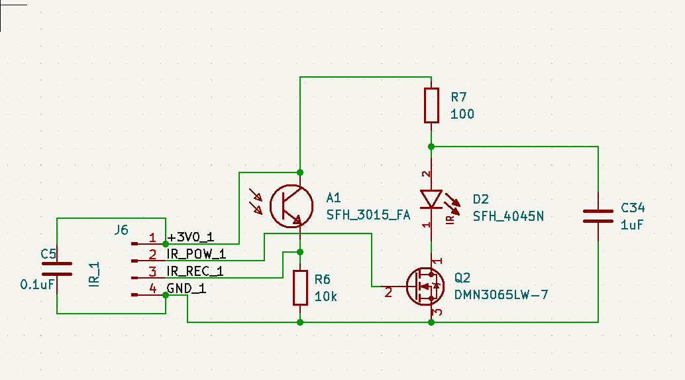
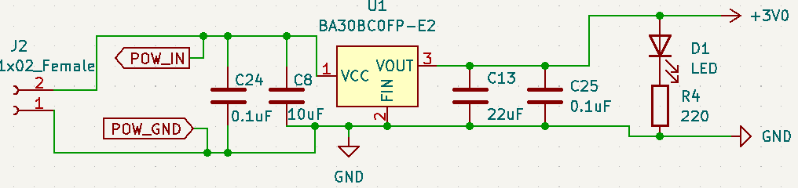
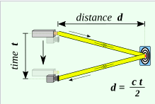
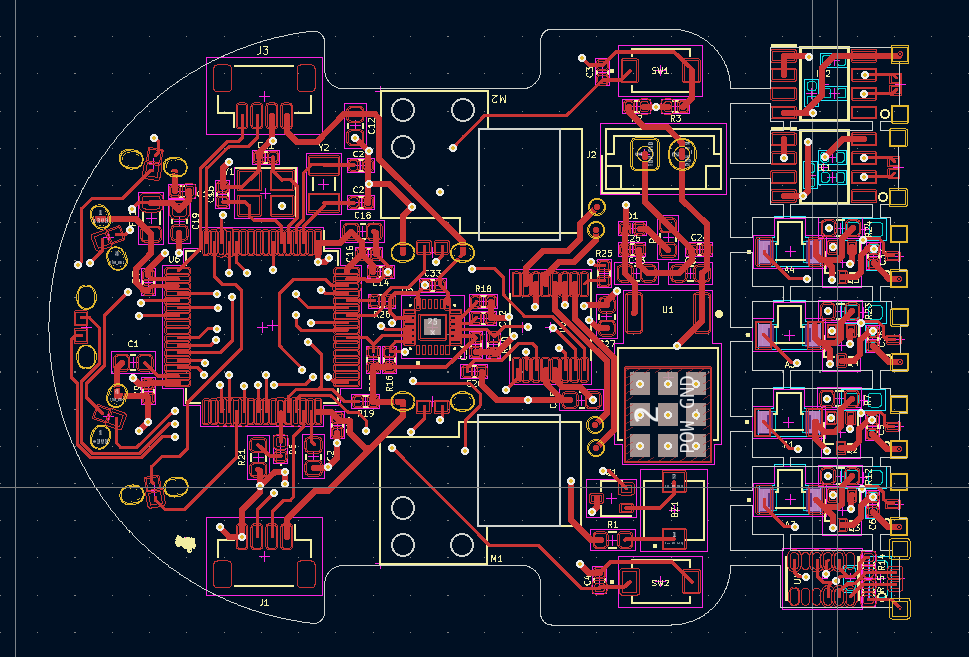
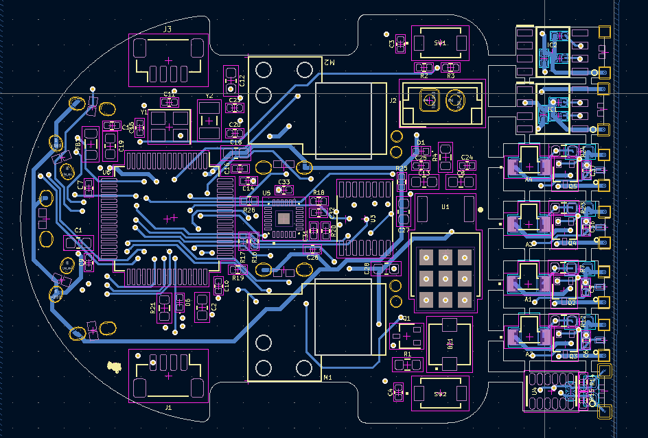

# PCB Design

The Mushak PCB design is made on the latest version of KiCAD 6.

Mushak is designed over STM32F405RG microcontroller accomodated eith various sensors and drivers for the micromouse.

We designed the smallest micromouse that is based on STM32F405RG microcontroller

### Major components used in the PCB include -

- STM32F405RG - Microcontroller
- VL6180x - ToF sensor4
- DRV8833 - Motor Driver
- MPU6500 - IMU
- SFH-4045N - Infrared Emitter
- SFH-3015-FA - Phototransistor (Reciever)

---

## IR sensors

The IR sensors include majorly two components, IR emitter which emits the Infrared light of a perticular wavelength which is not visible with the human eye. 

This light gets reflected back from the obstacle present in fromt of the robot to the photo transistor, when the Infrared light of this perticular wavelength enters the phototransistor device it allows the current to flow from the collector to the emmiter of device. This current flow creates a voltage drop across the resistor connected with the photo transistor and this voltage drop is read by th ADC of the microcontroller which varies as the intensity of light reflected changes. By this way we can determine how far is the obstacle from the robot.

For controlling the intensity of the transmitted light we used N-Channel Mosfet whose gate is controlled by PWM signal given by the microcontroller.
By varying the PWM duty cycle we can control the intensity of the transmitted light from IR emmiter by which we can control the distance sensitivity.

4 Sensor pairs are being used in Mushak (Micromouse)

---

## Power Distribution
Power to the control circuits is provided by 3V linear Regulator(LDO) which can provide upto 1A current. Power to the motor is directly given to the motor driver through battery.
Additional capacitors are added across outputs for filtering out the voltage. Voltage divider resistors are being used to monitor the battery voltage. Power indication LED has been provided in the PCB. The input voltage for the PCB is 3.7 voltage through a general LiPo battery.

--- 

## STM32F405RG (Microcontroller)

The below image shows the pinout of STM32F405RG that we will be using for this project :

Decoupling capacitors of 0.1uF are connected near the vdd pins of STM32. Additional external low and high frequency oscillators are added for precise timing.

- HSE(High Speed External) clock - 25 Mhz
- LSE(Low Speed External) clock - 32.769 Khz

Filter circuit is being used for filtering out the analog reference voltage. Additional Debug switches are being added for debugging purposes

---
## DRV8833 (Motor Driver)

We have used H-bridge motor driver which can control two motors at the same time via PWM (pulse width modulation) from the STM32F405RG (microcontroller).

The motor driver can supply 1.5 Amps of current per motor which is enough to power up the coreless motors. 

This motor driver keeps the controls terminals from the microcontrolller isolated from noise and high volatages of the motor power supply.

---

## VL6180X (ToF Sensor)

We added a Time of Flight sensor in front of the robot to measure the distance of the obstacle in front from the robot.

This sensor measures the time taken by the light signal to get reflected from the obstacle and then measures the distace of the obstacle from the robot.

The sensor uses I2C protocol for communication with the microcontroller and send the distance values. It also has an additional feature of sensing the ambeint light which we can use to avoid the problems faced with IR sensors due to varing ambient light conditions.

---

## HC-08 (BLE Module)

We used a BLE(Bluetooth Low Energy) module to talk to the robot. It is one of the most important modules that is being used in mushak, this bluetooth module will eanble us to talk with the robot and precisely tune it to solve the mazes, additionally it makes debugging easier for us making Mushak user friendly.

The module consumes very less power and works on UART communication to talk with the microcontroller.

For attaching this module we have provided the JST connectors to connect this module externally when required.

---

## AS5600 (Magnetic Encoder)

To measure the RPM and teh distance that the robot has covered we needed a type of encoder feedback. For this we used AS5600 magnetic encoders to measure the amount of rotation of the robot wheel.

The magnetic encoders are mounted in an innovative way due to which no external mounts were required for their placement.

The sensor works on I2C communication protocol to provide the feedback to the microcontroller.

---

## MPU6500 (IMU)

This sensor gives the feedback of orientaion of the robot. This MEMS based chip has in-built Acclereometer and Gyroscope by which it can determine its orietation with respect to space.

This sensor works on SPI as well as I2C communication protocol but in our case to get the fastest data transfer, we used use SPI communcation.

---

## Routing

Front Copper Layer:

Back Copper Layer:

Final Routing:

For routing of the control circuitry we used traces of 0.2mm width and for power connections we used 0.4mm width tracks to ensure fairly high current flow.

These are some images of the routing done on Mushak -
## Solutions to some of the major problems faced while designing PCB

1) Minimalising passive components is a really hard task. So to solve this I properly reffered the application notes and datasheet of stm32f405RG. Moreover the design is well tested on simulation platform.

2) Efficient placement of components to reduce the size of the PCB. Innovative design to fix sensors and encoders in such a small space.

3) Since IRs are sensitive to ambient light we required a mechanism to adjust the brighness of IR Emitter. So to do that we used a mosfet based circuit, so brightness can be controlled using PWM.

4) It was a big challenge to place 90+ SMD and THT components on a small size PCB of just 45.7x40mm size.